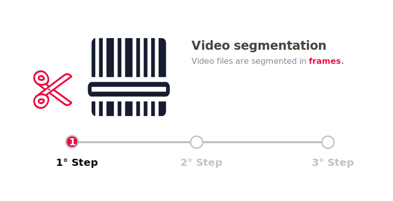
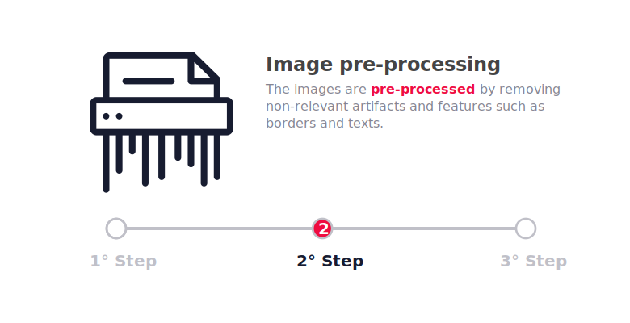
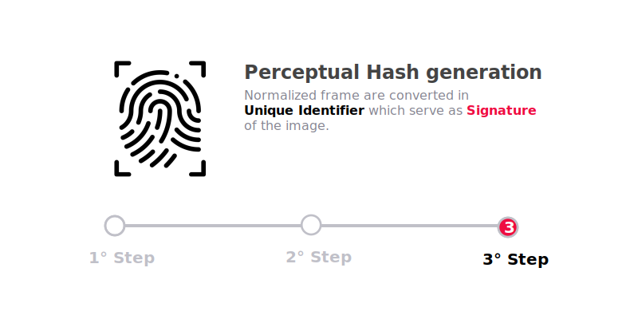
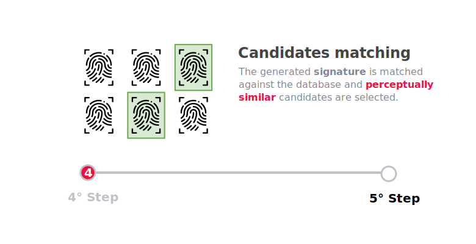
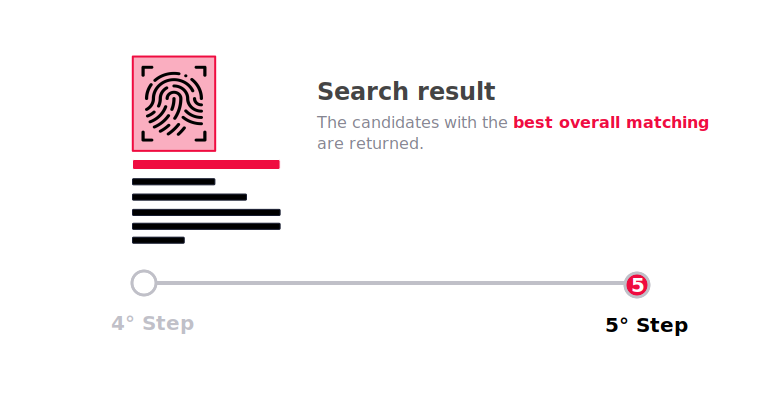

## Perceptual hashing

Ashen manipulates and elaborates images by extrapolating their features through a [Locality-sensitive hashing](https://en.wikipedia.org/wiki/Locality-sensitive_hashing) algorithm which relies on the [MPEG-7 color layout descriptor](https://ieeexplore.ieee.org/document/959135). The extracted features are then serialized and flattened into a signature (or fingerprint) that identifies the processed image or video frames.

Perceptual hashing algorithms do not rely on all the single features of an image but rather on its general context, it is therefore resilient to minor crops, edits, and alterations. As a result, Ashen finds way more interesting and reliable use cases in real world scenarios than traditional hashing algorithms.

## Internal process
An high level explaination of the process behind **Ashen** will be provided. The process applies both to `Images` and `Video`, with the difference that the video files are segmented in sequence of frames using an algorythm developed by Animeshon's Research Department.

### Content indexing
The following process shows how Ashen indexes `Images` and `Video` and creates a **signature database** capable of recognize partial, entire, edited and corrupted video or image files.

In the case of a `Video File` Ashen cuts the video in **Frames**. Doing so Ashen will break down the task of indexing a video in more simpler tasks of indexing images.

The images are then preprocessed ensuring that all feature and artifacts that could lead to a missgeneration of the `signature` are removed.   

:::note
An example is the removal of black/white borders which are normally used when people create memes.
This process can be externalized in third-party application and it is explained in depth in the [Image Preprocessing](/docs/ashen/concepts#image-preprocessing) section.
:::

:::warning

The Image Preprocessing Process can be changed and optimized at any time.  
If you are a maintainer of a `Community Ashen Client`, pay attention to changes in the preprocessing algorithm in order to keep the client up-to-date.

:::

Ashen finally generates an **Unique Identifier** used as `signature` to itentify the ***image's perception***.

:::note
See [Ashen's Perceptual Hashing](/docs/ashen/concepts#ashens-perceptual-hashing) for a detailed explaination about the `signature` generation process.
:::

### Reverse search by image or video
Performing a search by `Image` or `Video` against [Ashen](/docs/ashen/introduction)'s database can be performed in 2 different ways:

* *Upload* the content and let Ashen handle the generation of the `signature` and matching process.  
In this case Ashen performs the above **3 steps**.
* *Generate the `signature`* and delegate to Ashen only the matching process. In this case [official clients](/docs/ashen/sdk/quickstarts) are recommended to generate healthy `signatures`.

The `signature` provided (no matter if it was provided by the client or after an internal generation) is matched against the one already indexed in the database.

The candidate which better match the provided `signature` is finally returned along with metadata informations of the original contents.

## Image preprocessing

#### Work in progress

More informations will be made available on [Discuss](https://discuss.animeshon.com) and [GitHub](https://github.com/animeshon) as development continues.
