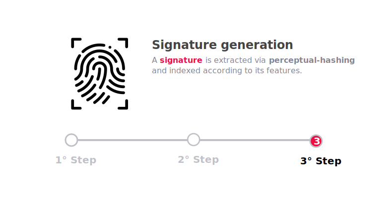

## Perceptual hashing

Ashen manipulates and elaborates images by extrapolating their features through a [locality-sensitive hashing](https://en.wikipedia.org/wiki/Locality-sensitive_hashing) algorithm which relies on the [MPEG-7 color layout descriptor](https://ieeexplore.ieee.org/document/959135). The extracted features are then serialized and flattened into a signature (or fingerprint) that identifies the processed image or video frames.

Perceptual hashing algorithms do not rely on all the single features of an image but rather on its general context, it is therefore resilient to minor crops, edits, and alterations. As a result, Ashen finds way more interesting and reliable use cases in real world scenarios than traditional hashing algorithms.

## Methodology

A high-level explanation of the process behind **Ashen** is provided in the following section. The process applies both to `Images` and `Video`, with the only exception that video files are segmented in a sequence of frames using video analysis and manipulation tools.

### Indexing

The following process shows how Ashen indexes `Images` and `Video` subsequently building a **signature database** capable of recognizing original, compressed, cropped, edited, and corrupted video or image files.

In the case of a `video file`, Ashen splits the video into multiple **frames**. This process allows Ashen to break down the task of indexing a video into a much simpler task of indexing images.

The images are then pre-processed to ensure that all the features and artifacts that could lead to a mismatch are removed.   

:::note

A practical example of this process is the removal of white or black borders from a screenshot.

:::

<!-- 
:::warning

The Image Preprocessing Process can be changed and optimized at any time.  
If you are a maintainer of a `Community Ashen Client`, pay attention to changes in the preprocessing algorithm in order to keep the client up-to-date.

::: -->

Ashen finally generates a **fingerprint** of the image itself which serves as a unique `signature` for the database indexing and query.

:::note

See the [perceptual hashing](/docs/ashen/concepts#ashens-perceptual-hashing) section for a more detailed explaination of the `signature` generation process.

:::

### Search

Performing a search by `Image` or `Video` against the [Ashen](/docs/ashen/introduction) database can be performed in 2 different ways:

* *Upload* the content and let Ashen handle the generation of the `signature` and the matching process.  
In this case Ashen performs the **3 steps** described in the previous section.  

* *Generate the `signature`* and delegate to Ashen only the matching process. In this case the [official SDK](/docs/ashen/sdk/quickstarts) is recommended to generate valid `signatures`.

The `signature` provided (no matter whether it was generated by Ashen or the SDK) is matched against the ones already indexed in the database.

The candidate which results in the best match is returned along with metadata information of the original content.

<!-- 
## Image preprocessing

### Work in progress

More informations will be made available on [GitHub](https://github.com/animeshon) as development continues. -->
