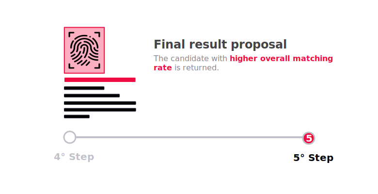

***Ashen*** is a experimental system built on top of the [Perceptual Hashing](https://en.wikipedia.org/wiki/Perceptual_hashing) algorithm rewriting and optimizing the implementation developed by [trace.moe](https://trace.moe/).

## Perceptual Hashing
The Perceptual Hashing algorithm manipulates and elaborates images extrapolating the identifining characteristic of the image itself. Big part of the manipulation of the image aims to remove minor features which do not indentify the context but will only add noise to the generation of an identifier of the image.

Therefore the Perceptual Hashin, not relying on all the feature of the image but just on it's context, is resilient to crops, edits and alteration of the image.

Not being an algorithm which generates an identifier based on the raw bytes contained in the image, but using the perception of the image as whole, the Perceptual Hashing Algorithm finds way more interesting and reliable application in real wolrd scenario

## Ashen
Ashen brings the Perceptual Hashin out of it's confort zone, the images, and exploits the capability of generateing an identifier ignoring all *useless* or *secondary* features of an image in favor of all those key traits to analyze and index **Video Files**.

Until now the Japanese Multimedia Community had to rely on algorithms which, given a file, generates a fingerprint base on the physical state of the bytes of the file itself. One frame edit, one byte curroption results in a completely different fingerprint.

Ashen do the oposite, generating a Perceptual Hash Fingeprint for each frame in the file it is capable of index not the file but the content.
No matter the resolution, hard subtitles, censorship, edits or localization Ashen is able to detect a previusly indexed video and return the references to the ***Episode*** and/or ***Anime***.

### Ashen Internal Process
The following paragraph will give an high level explaination of the process behind **Ashen**. The process applies both to `Images` and 	`Video`, with the difference that the video files are segmented in sequence of frames (nothing else that static *images*) using an algorythm developed by Animeshon's Research Department.

#### Image / Video Indexing
The following process shows how Ashen indexes Videos and Images and creates a lookup database capable of recognize partial, entire, edited and corrupted Video / Image files.

 

In the case of a `Video File` Ashen cuts the video in **Frames**. Doing so Ashen will break down the task of indexing Video in more simpler tasks of indexing Images.

 

The images are then preprocessed normalizing colors, resolution, and removing artifacts and features not needed for the generation of the `fingerprint`.   
This process can be externalized in third party application is explained in depth in the [Ashen Client](../ashenclient/ashenclient_theory#image-preprocessing) section.

 

Once the immage has been normalized and cleaned up, Ashen finally generates an **Unique Identifier** used as `Fingerprint` to itendify the ***image's perception***.

 

#### Search by Image / Video
Performing a search by Image or Video against Ashen's database can be performed in 2 different ways:

* *Upload* the content and let Ashen handle the generation of the Perceptual Hash searched.
* *Generate the Perceptual Hash locally* and delegate to Ashen only the matching process. In this case use the documentation present [Ashen Client](../ashenclient/ashenclient_theory#image-preprocessing) section to generate healty Perceptual Hashes.

In the first case Ashen performs adain the above **3 steps** to generate the `Perceptual Hash Fingerprints` from the content.
After that the Search Process is the conceptually the same.

The `Perceptual Hash Fingerprint` provided (no matter if it was provided by the client or after an internal generation) is matched against the Hashes alread present in the Database.

The candidate which match better the provided `Perceptual Hash Fingerprint` is finally returned along with information of the content which generated the **Fingerprint** such as Episode and/or Anime IDs.