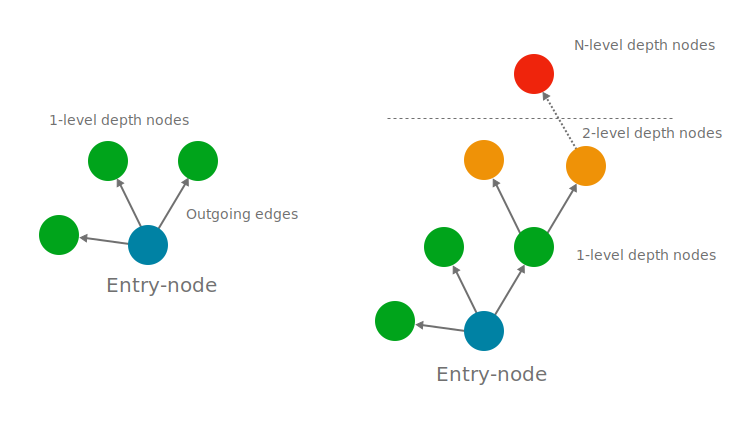

## A Big Graph
Detabesu is powered by a Graph Database. The data is imported and exposed as a big `Graph` composed by `Nodes`, the actual data, and `Edges` representing the relation between data.

 

### Traverse the Graph
Given an *entry-node* Graph Database allows to traverse the outgoing edges and reach related nodes (data) recursivelly.  
The flexibility of reach any *N-distant* linked **Node** by simply traverse the outgoing **Edges** is what distinguish a Graph Database from a Relational one.   
As long as 2 nodes are linked with *N-Step Edges*, it's possible to build a **O(N) execution time** query starting from the *entry-node* to the *target-node*.

 

The flexibility of the Graph Databases well synergizes with `declarative query languages` like GraphQL. Detabesu offers a rich [GraphQL Interface](graphql/quickstarts) which reflects completelly the **underlying satabase schema**, allowing developers to traverse the Knowledge Base as they need.  
Ultimatelly Detabesu offers the Data Fundation needed to dive bith to a new generation of Manga/Anime/Visual Novels/... related applications and platforms.