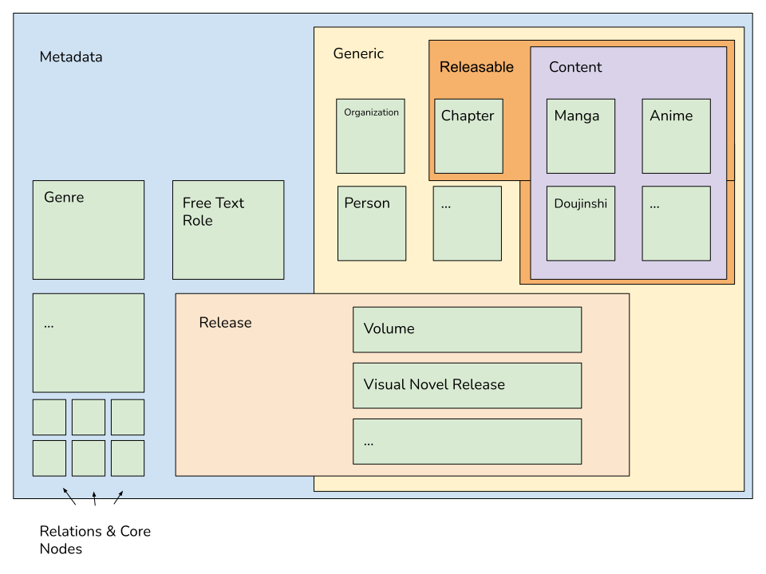

The following section will cover some high-level aspect of **Detabesu**'s architecture and design patterns.
For more technical and practical information consult to the [GraphQL](/docs/graphql/quickstart) section.

## Think in Graph
Detabesu is powered by the experimental [Dgraph](https://dgraph.io/) *graph database*. As for every other graph database, it comes with very different paradigmes copared to a more "traditional" environment where developers interfaces with relational databases and RestAPIs interfaces. For more information abou the concept behind a Graph database, consult Detabesu [Concepts](/docs/detabesu/concepts) section. 

The shift to a graph data structure from a tabular (SQL) or document (NoSQL) data structures makes a lot easier and faster the navigation between **Nodes** (entities) linked together by **Edges** (relations) but introduces some new constraint and requires the developer to adjust the way of thinking about the data itself.

### Local scope lookup
While traversing the graph it's possible to inspect, filter and manipulate only the **attributes** or **edges** of the nodes in the `current level` of the the graph. In other word is not possible to look ahead in some N-nested level nodes and use their *properties* to modify the behaviour of the query.

EG:

Given a basic schema where we have
```
// structure which holds anime's informations
AnimeNode {
    ....
    starrring StarringNode
    ...
}

// structure which describes the cast of an anime, providing information about the role of the character (Main, Support, ...)
StarringNode {
    ...
    anime AnimeNode
    characterRole ENUM
    character CharacterNode
}

// structure which holds characters's information
CharacterNode {
    name String
    gender ENUM
    castIn StarringNode
}
```
Let's pretend that we want to retreive all `FEMALE` characters for a given anime.

#### Relational solution
If we were working with a relational database, we would come out with something like
```
SELECT * from character c, starring s, anime a, WHERE a.id = SOME_ANIME_ID, s.animeID = a.id, c.id = s.characterID, c.gender = "FEMALE";
```
we all are familiar with this kind of syntax and it's quite trivial how to filter the results of the query by a field which is 3 level deep in our relation chain (Anime > Starring > Character). The huge problem is that we are merging 3 differnt tables using 4 different fields, which could be acceptable for small dataset and small relation chains, but will definitelly underperform if one of those 2 variable grows.

#### Graph solution
Using Detabesu, and more preciselly GraphQL to communicate the underlying graph database, the query will look quite different
```
{
    getAnime(id: SOME_ANIME_ID) {
        starring {
            character (filter: {gender: {eq: "FEMALE"}}){
                ... whatever field i need
            }
        }
    }
}
```
because we are developers of the finest culture, you might notice that we are filtering only the `character` level of the query, and therefore we expect to retreive a bunch of empty `starring` nodes (presumably all those which are linked to *non female character*). 
On the other hand, it's clear that we are not joining or merging any table:
Once we enter the **Entry Node** identified by `SOME_ANIME_ID` we are only following the edges with a cost of **O(1)**. We are quering the subgraph rooted in `SOME_ANIME_ID` and therefore the actual amount of `AnimeNode`, `StarringNode` and `CharacterNode` will **never** affect the performances of the query.


This shows how the Graph Database don't allow the client to ask for resources based on **nested node's properties**.
Something like
```
{
    getAnime(id: SOME_ANIME_ID) {
        starring (filter: {character.gender: {eq: "FEMALE"}}){
            character {
                ... whatever field i need
            }
        }
    }
}
```
is not possible, if not trough a custom resolver, which has to be designed and implemented by hand by some internal developer and given the size of Detabesu's schema, is not  for all attributes of all entities of the database.

:::info

We are open to the eventual implementation of some custom resolvers, if the community need them and makes request through our official [Discuss](https://discuss.animeshon.com)

:::

:::warning

Fortunately Detabesu provides some directives to avoid and work around those limits and are described in the GraphQL [Tips and Trick](/docs/graphql/tips-and-tricks) section.

:::


### The right query at the right Time
Graph database are very smart and quick at performing **well designed** queries, but can become quite lazy and slow if what we ask is asked in a **non-optimal** language.

For instance, it's like asking the waiter to read the entire menu, plus all wines, while you feel like you want a *Tiramisu*.
Of course at some point the waiter will reach the dessert section, but the whole process would have been lot faster if you started by asking the dessert list, or even better if you directly asked if the *Tiramisu* was available.


Let's show this concept with a more practical example:

Given the previous schema
```
// structure which holds anime's informations
AnimeNode {
    ....
    starrring StarringNode
    ...
}

// structure which describes the cast of an anime, providing information about the role of the character (Main, Support, ...)
StarringNode {
    ...
    anime AnimeNode
    characterRole ENUM
    character CharacterNode
}

// structure which holds characters's information
CharacterNode {
    name String
    gender ENUM
    castIn StarringNode
}
```
let's say `we want all Animes whith a character named "Sakura"`.

You might be tempted in creating a query like
```
{
    getAnimes() {
        ... whatever field i need
        starring {
            character (filter: {name: {eq: "Sakura"}}){
                ...  whatever field i need
            }
        }
    }
}
```
We are searching `Animes` which have a `Character` named `Sakura`, right?
**Wrong**

By doing so we are asking the database to check **all** AnimeNodes, follow the `starring` edge, follow the `character` edge, and finally check if any character's name matchs `Sakura`. We basically traverse all the possible Anime's subgraph and filter by a nested node's field, which is definitelly not the right way to get do it.

By looking better at out problem: `let's say we want all Animes whith a character named "Sakura"` it's clear that what we already know is the `name` of the `character`, which reduces the possible character to a very small subset. By reversing the question we could ask to the database 
`given the subset of all characters named "Sakura", tell me all the Animes in which them appear`:

```
{
    getCharacters(filter: {name: {eq: "Sakura"}}) {
        castIn {
            anime {
                ...  whatever field i need
            }
        }
    }
}
```

by applying the filter at the root level, we recuce the number of the **Entry node** to those we really need and want, from that the rest of the query is just walking from the `character` to the `anime` following the edges.

#### Take away
<u>The better we design the query, the better Graph Database perfom.</u>

## Detabesu abstraction design

The first big revolution Detabesu brings to the Japanese Multimedia Content information ecosystem is the structure of the data available.
Most of the existing service provide data in an unstructured or not-well-known-structured way, which leads very orftet to question like "What am i watching at?" or more techinically to spagetti code workarounds to accomodate the specifications provided.

Detabesu expoloits the native concept of `interface` of GraphQL, which is equivalent to `generics` or `interfaces` in programming language you might already know, to create an intuitive and easy to understand dataset.

`Interfaces` are high-level definition of structures which have some aspects in common.
For example the `interface` class `car` is the set of all model, manifacturers, type of machine with 4 wheels.



In the above picture is shown the hierarchy of the main `interfaces` you will encounter by using Detabesu.

:::info

For a more complete insight of the `interfaces` in Detabesu, consult the GraphQL [Schema](docs/graphql/schema) page.

:::

### Metadata
```
interface Metadata {
  id: String! @id
  selfLink: String!
  createdAt: DateTime!
  modifiedAt: DateTime!
  version: String!
}
```

`Metadata` is the highest level of abstraction of the entities in Detabesu.
It describes metainformation about the entity. Every entity in Detabesu implements `Metadata`.


### Generic
```
interface Generic {
  names: [Text!]!
  aliases: [Text!]!
  descriptions: [Text!]!
  images: [ImageWrapper!]!
  crossrefs: [CrossReference!]!
  websites: [WebAddress!]!
}
```

`Generic` describes the primary entities of Detabesu.
Those entities are standalone, which mean that they don't need any other entity to have meaning and they carry meaningful information about something.
Example of `Generic` are:

 * Anime
 * Chapter
 * Person
 * Organization
 * ....

### Content
```
interface Content {
  status: ContentStatus!
  relations: [ContentRelation!]! 
}
```

`Content` describes all those entities which carry information about serializable contents.
`Content` is a subset of `Generic` and identifies only the entities which have a `status` (On-Going, Completed, ...) and `relations` (sequel, spin-off) with other `Contents`.

Example of `Content` are:

 * Anime
 * Manga
 * Doujinshi
 * Manga
 * Visual Novel

:::info

As the amount of content digested in Detebesu grows, more and and new `Content` types will be added.

:::

### Release
```
interface Release {
  contents: [Releasable!]!
  languages: [Language!]!
  releaseDate: DateTime
  medium: [Medium!]!
  censorship: CensorshipType!
  """
  EAN10 ISBN10, all barcodes with 10 digits
  """
  ean10: String
  """
  UPCE 6 digit barcodes
  """
  upce: String
  """
  UPCA 12 digit barcodes
  """
  upca: String
  """
  EAN13 JAN/ISBN13, all barcodes with 13 digits
  """
  ean13: String
  """
  SKU / catalog number
  """
  sku: String
}

```
`Release`, togeter with `Releasable`, are the main and biggest difference bwetween Detabesu and any other existing service.
We designed this `interface` to group all those entities which describe **a medium to release and distribute the `Releasable`**.
Al the entities implementig `Release` are the physical (or digital) goods someone has to buy in order to consume.

:::warning

Chapter and Episode have not been categorized as `Release` because they are not tangible goods. In fact Episode are **broadcasted** or **sold as DVD/BD** in order to be consumed, and Chapters are **serialized** and **sold in volume** or distributed digitally.

:::

Example of `Content` are:

 * Volume
 * Visual Novel Release
 * Music Collection

### Releasable
```
interface Releasable {
  releases: [Release!]
}
```
`Releasable` describes all those entities which can be released.

Example of `Releasable` are:

 * Anime
 * Episode
 * Light Novel
 * Chapter
 * Visual Novel
