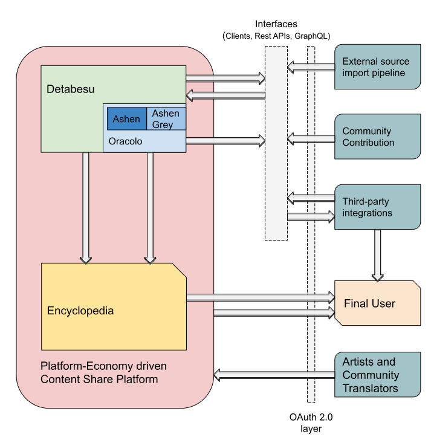

## The Ecosystem
This page shows how Animeshon's products and services are ment to interact with each other, with the users, with the content creators and with third-party services. The compoenets will be released according to [Animeshon Roadmap](/docs/ecosystem/roadmap).

All the Tools, Service and features Animeshon plans to release to the community are ment to become the foundation of a new Japanese Multimedia Content's Ecosystem. We expect this Ecosystem to be **highly technological**, **inclusive** and **interactive** for ***all*** segments involved.

We internally created two macro objectives to achieve in order to reach Animeshon's final goal:

* Release of a `foundation toolset` to the public  
This phase is ment to improve the ***interaction's quality of the Community*** with the **existing content** through the standardization and exposure of available informations.
* Development of a `Platform-Economy`  
The creation a place where Artists, Fans and Translators can directly interact creating value for everyone.  
This phase is ment to disrupt the way in which **new content** is ***produced, distributed and supported***.

We are currentrly developing the components required to create the `foundation toolset` addressed to the worldwide Community, prioritizing the user experience, enjoyment and discovery of the content.

## Animeshon's Ecosystem in detail.

#### Detabesu 
As shown in the above diagram, the core of our Ecosystem is [Detabesu](/docs/detabesu/introduction), a Graph-Knowledge Base containing virtually all existing information about the Japanese Multimedia Industry. **Detabesu** has been designed to be expanded and kept up-to-date in two different ways:

* A [Community contribution to Detabesu](/docs/ecosystem/roadmap) system similar to Wikipedia and other existing project.
* [Mass Import into Detabesu (Wormhole Pipeline)](/docs/ecosystem/roadmap) of information from `External Sources` which might want to become part of the Ecosystem in the future.  

We expect Detabesu to become a *stable and self-updating* **source of truth** for every user, developer and third-party systems.

The entire dataset is exposed by a powerful [GraphQL Interface](/docs/detabesu/graphql/quickstarts) which allows third-party systems to traverse the Knowledge Base without constraints or restrictions.

#### Oracolo
[Oracolo](/docs/search-engine/introduction) provides search capabilities against Databesu's data.
It will be a powerful entrypoint capable of **text search** as well as **reverse image / video search**. 

Oracolo will expose both `RestAPIs` and `GraphQL` interfaces to allow the direct integration of the search capability of this component by third-party services.

#### OAuth 2.0 Layer
TODO CHRISTIAN

#### Open Source Encyclopedia
Animeshon plans to develop an [open source Encyclopedia](/docs/encyclopedia/introduction) designed to visualize and interact directly with the Detabesu's data. The **Encyclopedia** will be our official gateway to consult, navigate, discuss, rate and discover the informations Animeshon provides to the public.  

:::note
This component targets only the final user, not developers and third-party systems directly.
:::

#### Content Share Platform
The last component of the Ecosystem is a [Content Share Platform](/docs/ecosystem/roadmap) driven by our `Platform-Economy` concept.

Given the complexity and requirement of this component, we expect it to be developed and released after the stabilization of the other components.