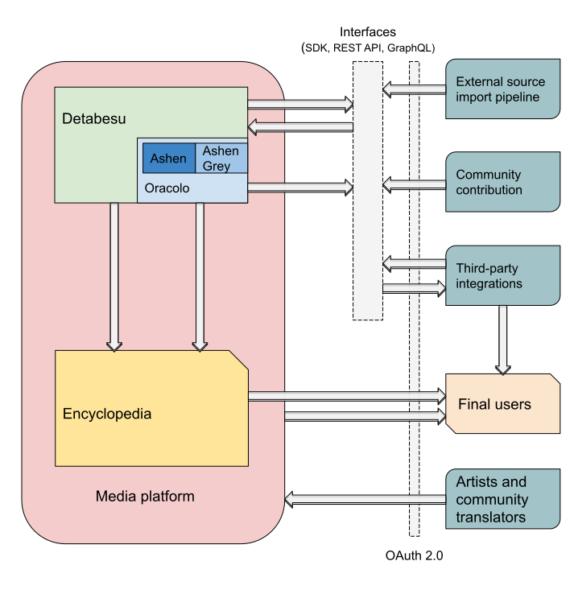

All the Tools, Service and features Animeshon plans to release to the community are ment to become the fundation of a new Japanese Multimedia Content's Ecosystem. We expect this Ecosystem to be Highly Technological, inclusive and interactive for **all** segments involved in the Culture.

We internally created two macro objectives to achieve in order to reach Animeshon's final goal:

* Release of a `fundation toolset and essential services` to the public  
This phase is ment to improve the ***interaction's quality of the Community*** with the **existing content** trhough the standardization and exposure of the available informations.
* Development of a `Platform-Economy diven Platform` where Artists, Fans and Translators can directly interact creating value for everyone  
This phase is ment to disrupt the way in which **new content** is ***produced, distributed and supported***.

In respect with our [Roadmap](roadmap), we are currentrly developing the components required to create the `fundation toolset and essential services` addressed to the worldwide Community. We prioritize the user experience and enjoyment of the content. We believe that once the this community will have access to the required tools, we all will witness the birth of countless Applications and Platforms.

## Animeshon's Ecosystem in detail.

#### Detabesu 
As shown in the above diagram, the core of our Ecosystem is [Detabesu](/docs/detabesu/introduction), a Knowledge Base containing virtually all existing information about the Japanese Multimedia Industry. **Detabesu** has been designed to be expanded both by the users though  a [Community Contribution](...) system similar to Wikipedia and similar existing project and though a [Mass Import Pipeline](...) of information from `External Sources` which in future might want to become part of the Ecosystem.  
Thanks to those two information source, we expect Detabesu to become a *stable and self-updating* **source of truth** for every user, developer and third application integrated.

The entire dataset is exposed by a powerful [GraphQL Interface](/docs/detabesu/graphql/quickstarts) which allows third-party systems to traverse the Knowledge Base without constraints or restrictions.

#### Search Engine (Ashen, Ashen Grey)
[Ashen](/docs/detabesu/introduction) and [Ashen Grey](...) togheter with a Fulltext serch engine represent the [Search Engine](/docs/search-engine/introduction) of Detabesu.   
It will be a powerful entrypoint for users and third-party systems capable of perfom standard **Text search** as well as **reverse Image / Video search**. 

The Search Engine will expose both `RestAPIs` and `GraphQL` interfaces to allow the direct integration of the search capability of the component by third-party services.

#### OAuth 2.0 Layer
TODO CHRISTIAN

#### Open Source Encyclopedia
Animeshon plans to develop an [open source Encyclopedia](/docs/encyclopedia/introduction) designed to visualize and interact directly with the Detabesu' knowledge base. As the name says, the Encyclopedia will be our official gateway to consult, navigate, discuss, rate and navigate the informations Animeshon provides to the public.  

This component targets the final user.

#### Content Share Platform
The last component of the Ecosystem is a [Content share Platform](...) driven by the our `Platform-Economy` concept.

Given the complexity and requirement of this component, we expect it to be developed and released after the stabilization of the other components.