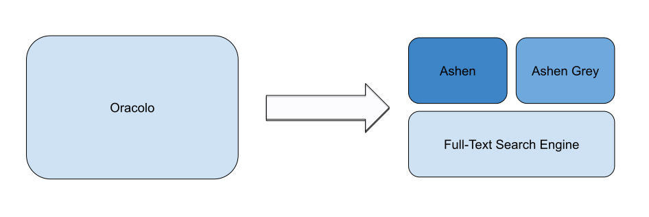

## Oracolo Architecture

Oracolo integrates *three* different search components. Each component provides different **search capabilities** for a ***specific domain*** and can be used as standalone services.

The components synergize with each other providing the best and most complete search experience possible, potentially covering all common use-cases of this industry.

### Ashen - (General Purpose) Reverse Image Search Engine
[Ashen](/docs/ashen/introduction) is the component responsible for the **indexing** and **searching** by image or video for the `Anime` domain.

### Ashen Grey - (Black and White) Reverse Image Search Engine
[Ashen Grey](/docs/ecosystem/roadmap) is a specialized version of [Ashen](/docs/ashen/introduction) optimized for **black & white** content. It is responsible for the **indexing** and **searching** by image for all resources distributed as black and white media, like `Manga` or `Doujinshi`.

### Full-Text Search Engine
A full-text search engine powered by [Elastisearch](https://www.elastic.co/). This component is responsible for text-related queries.
