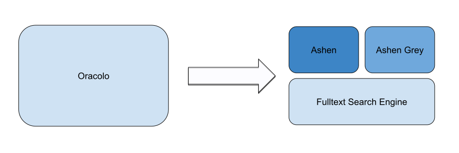

## Oracolo Architecture

Oracolo is the result of the combination of *three* different components. Each component provide **search capability** for a ***specific domain*** and can be used as standalone services.

The components synergize with eachoter providing the best and most complete search experience possible, potentially covering every single use-case of the Japanese Multimedia Industry.

### Ashen - Inverse video/image search for Anime
[Ashen](/docs/ashen/introduction) is the component responsable for the **indicization** and **search** by image or video for the `Anime` domain.

:::note

Ashen is also candidate to embed indexing and search capability for a larger variety of content (Visual Novels, Covers, Fan Arts, ...) 

:::

### Ashen Grey - Inverse image search for Black & White Content
[Ashen Grey](/docs/ecosystem/roadmap) is the component responsable for the **indicization** and **search** by image for all those content the `Manga`, `Doujinshi` domain. It is a specialized version of [Ashen](/docs/ashen/introduction) aimed to work with **black & white** content.

### Fulltext Search Engine
A fulltext search engine powered by [Elastisearch](https://www.elastic.co/). This component is responsable for every text query submitted.

